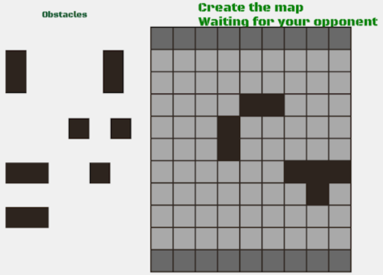
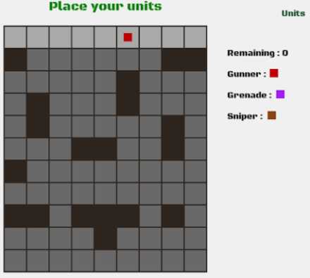
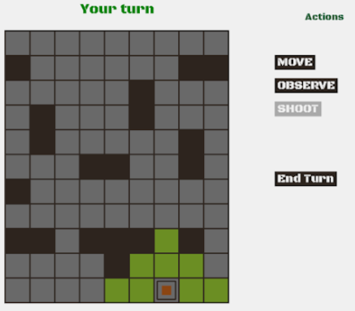
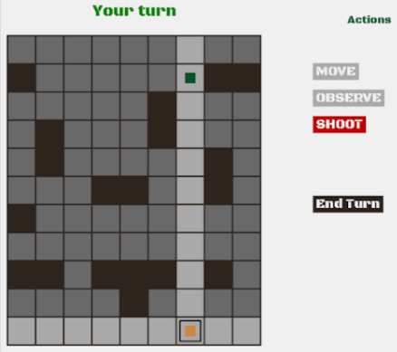

# StratObsGame

A board game we invented, requiring just one paper and 2 pencils. Winning will require strategy, patience, and bluff.
We adapted it on python, to allow you to play with someone else in lan.

    
    
    

## The Rules

To start a game you must first create a map, so that every game is unique !

You just take a piece, and place it on the board, then you wait for the other player to place a piece. The game starts when every piece is on the board.

You place every soldier of your team on your row.

You can move your units by clicking on it, then on move and then click on the green tiles.

You can observe the map with a unit. When a unit observes the map, it gives its position to the other player, and can no longer move for the rest of the turn... however, they can see every unit on the row and column they are (if not blocked by a block). 

If a unit sees an ennemy and if they are close enough, they can fire on the other unit. Depending on the distance, the unit will kill the other unit, or miss.

![Winning conditions]

You win if you killed every ennemy units, or if one of your units reached the ennemy row.

## Current project state

The game is working, with sound, and can be lauched twice on the same PC to start a game. Launching the game on two different PCs may not work.

## License

The content of this project itself is licensed under the [Creative Commons Attribution 4.0 International license](https://creativecommons.org/licenses/by/4.0/), and the underlying source code used to format 
and display that content is licensed under the [3-Clause BSD License](https://opensource.org/licenses/BSD-3-Clause).

## Contributors

* [** Baptiste Rossigneux **](https://github.com/AxelFarr)
* [** Axel Farrugia **](https://github.com/BabaVegato)
